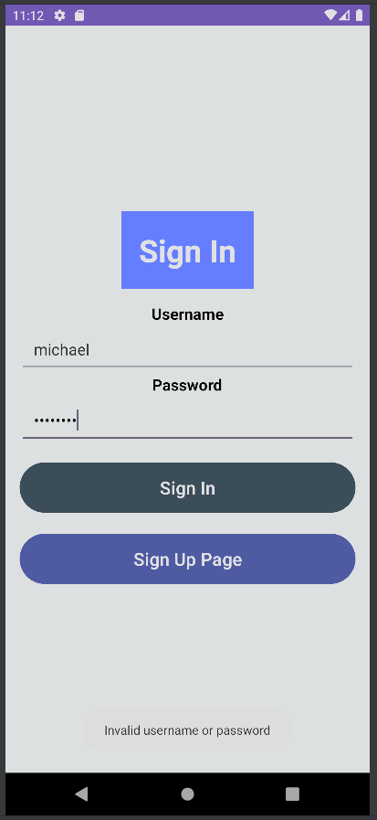
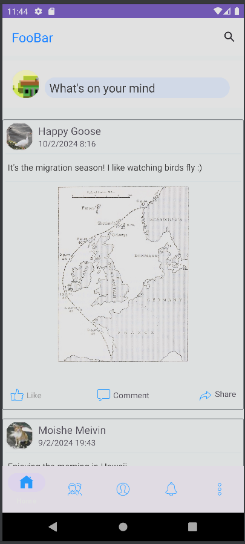
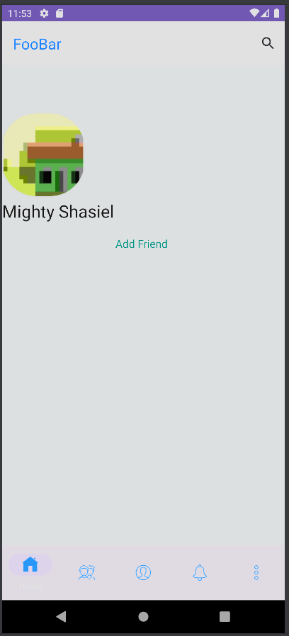
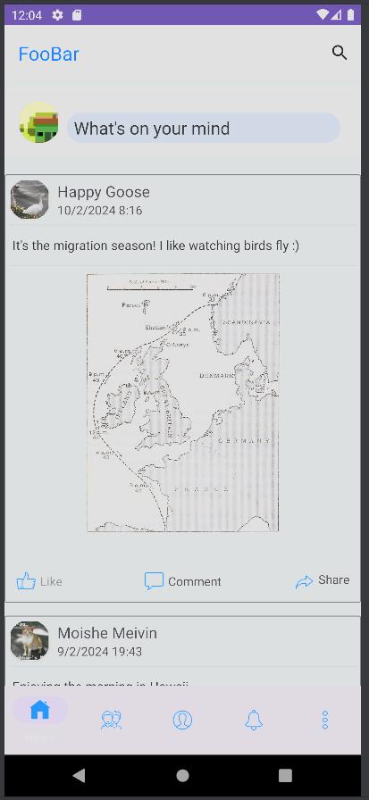
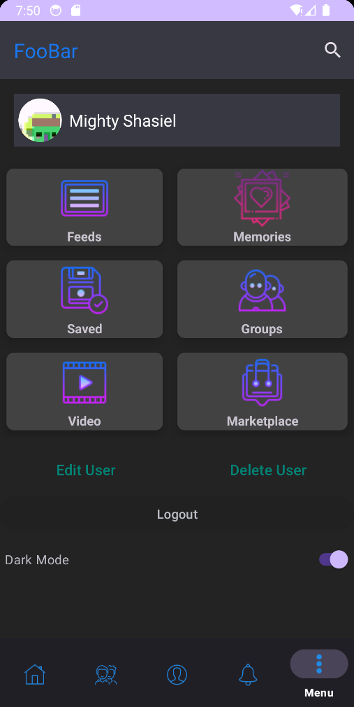

# Android Application Overview

## Running the Android Application
The Android application depends on backend server for basic functionality. So to run the android application, we first follow the instructions for [running the backend server](./backend.md). Afterwards, we open this repository in Android Studio, and after the initial setup, click the green "Play" button at the top.

**Note:** If you upload many large pictures, the app might become very slow and eventually crash. If you experience weird behavior from the app, delete the database *on the backend server* (this will also delete your account), and restart the app.

## Accessing and Using the Android Application
First, let's click the green "Play" button at the top.

After clicking the button and waiting for a little bit, the app will open on the phone to the right. From now on, we will focus on that part of the screen.

First of all, when you open the application the login page will appear.

Because we don't have an account yet, we will create a new one. First, we will press the "Sign Up Page" button at the bottom.

As you can see, the sign up page contains a form with the relevant fields. All fields have a clear and consice descripion of their expected value. The fields are validated, and will prompt the user when when the entered input is invalid.

Let's fill all the fields.

After filling the fields, we press the "Sign Up" button, which communicates with the server to create a new user. Once the user is created, the app goes to the feed, which include fetching the latest posts from the server. All data-related actions are executed on a separate thread, to ensure a smooth user experience.

We will explain the feed and menu in-depth later. For now, we will log out to show the login screen again.

If we try to login with incorrect details, a toast notification will be displayed in the bottom, telling you that the username or the password were invalid.

We will now login using the right details. At this point, the application sends a request to the server to fetch the user credentials. Afterwards, we are taken to the homescreen - the feed.

We will explain all features of the feed in due time. But first, let's create a new post by clicking the "What's on your mind" prompt at the top.

Here you can see that a new screen has been opened. It consists of a textbox at the top and an "add image button" at the bottom. Here, I typed some text at the text box, and added a selfie using the button at the bottom.

After pressing "Post" (on the top-right corner), the post is validated to make sure it is not empty, and then sent to the server.
After the post has been published, the feed is updated to include the new post and the post-creation screen is closed.

Sometimes the user might try to publish a post with a malicious URL, such as in this case:

As you can see, there's a nasty url which we don't want the users to be exposed to. Luckily our server uses the service of the bloom filter server, which forbid this nasty url, let's see what will happen.

As we can see, a toast message has been risen at the bottom of the screen. If you ask me, for this nasty post the user should be banned for life, but the bosses only care about money and engagement, so we only block this specific post.

The user can edit their own posts. By clicking the ellipsis on the top-right corner of the posts and choosing "edit", the edit screen will open.

As you can see, the full post details appears lets you edit them.

After editing the post and clicking "Post" again, updated post is sent to the server and the feed is updated.

A malicious user might try to circumvent our protection mechanism by posting a legitimate post and then editing it to include a malicious link.

As we can see, such an edit will be rejected, and a toast notification will notify the user about it:

The user might also delete their own posts. First, we click the ellipsis as usual.

And now, we choose "Delete"

As we can see, the post has been deleted.

We can also like post, either our own or from another user. To like a post, you click the "Like" button at the bottom-left corner of the post. When a post is liked, the button turns blue and the likes counter is updated.

Now, let's visit our profile. We can do so either by pressing the "profile" button at the bottom, or by clicking on our profile name next to a post published by us.

This is our profile page. We currently have no friends, so our friend list is empty right now. We can also see under "Posts" our published posts.

Now, I will logout and create a new user named "Shasiel Prime", so he can send a friend request to Mighty Shasiel.

Let's enter the profile of the first user - Might Shasiel, by clicking on their profile name next to their post.

We can't see his posts directly from his profile though, since we are not friends with him yet.

Let's fix that and sendi him a friend request, by pressing "Add Friend".

As we can see, the button has changed to say "Friend request sent".

Alright, let's log out again and back into Mighty Shasiel, so we can accept the friend request.

After logging in we go to the friends list By clicking the "Friends" button at the bottom.

We don't have any friend right now, so the list of friends is empty. Let's go to tour friend requests list.

We can see that shasiel2 sent us a friend request, and we can either accept it or reject it. Let's Accept the request by clicking "Add Friend" next to the request.

Now, let's logout and enter Shasiel Prime again, then visit Mighty Shasiel's profile again.

Ta-da! We can now see the friends list of Might Shasiel, and also his posts!

We can also like posts directly from the profile:

If we switch again and log into Mighty Shasiel, we can see that our post received a like. Nice! Of course, the button isn't blue, since the like is from another user, and not us.

Now, let's take a look at the menu, by clicking the vertical ellipsis on the bottom-left.

If we click "edit User", we can edit our display name and our profile image.

Success! We can see that our post has been updated with our new display name:

Finnally, we can delete our user by  clicking the "Delete User" button from the menu.

Deleting the user will take us to the sign-in page. Let's log back into Shasiel Prime.

We can see that all the posts of Might Shasiel have been deleted as well.

Finally, let's take another look at the menu:

We still haven't tried dark mode, so let's give it a try and see how the different screens adapt.

That's all there is to know about the Android application!
