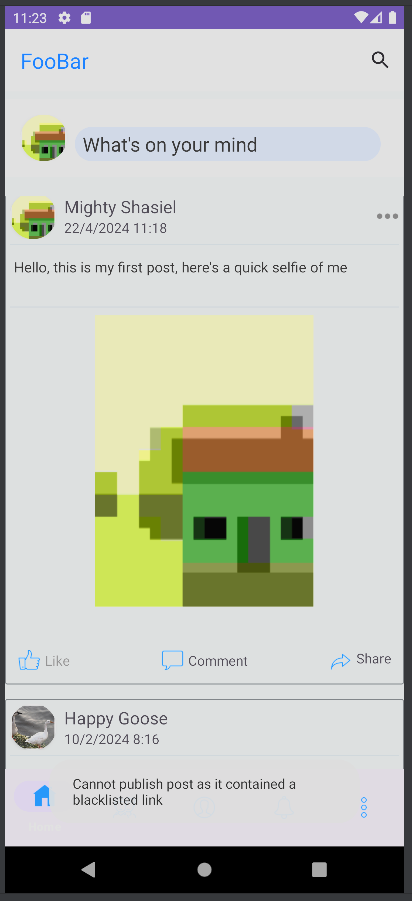
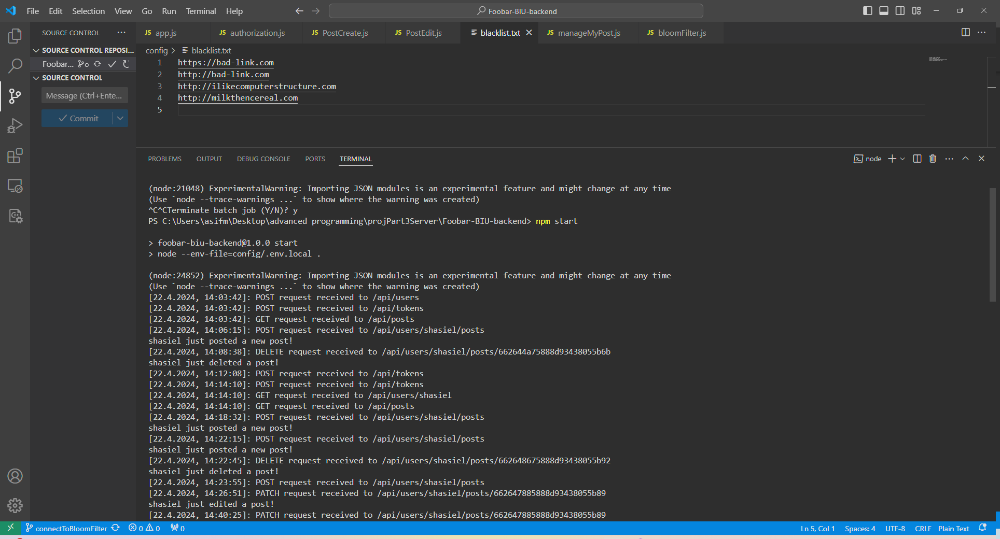

Foobar android application wiki
Note: All the actions performed using the server occurs on another thread so it will not ruin the user experience.

First of all, when you open the application the login page will appear

Because we don't got an account we'll create a new one pressing Sign Up Page button

As you can see, the sign up page has validations and prompts the user when he enters an invalid field

Now, after we set up all fields we will press the Sign Up button which communicate with the server and opens a new user,
then it will send a sign in request to the server and will go to the feed.

Now we will logout and go directly to the sign in page using the Logout button, clearing the jwt

We will login with invalid details to show you the toast it will do

Using the right details we will log in now, the application sending a request to the server and gets back the jwt that stored inside the userDetails singleton and will be reused to do actions like adding posts etc..

After pressing the What's on your mind, there's a UI opened by new activity, I added some content and I will press Post.
When Post pressed it will make a validation so its not a clear post and then will send to the server a request with the details
of the new post. When 200 will be recieved it'll add the post to the feed

As you can see, there's a nasty url which we don't want the users will share, luckily our server uses the service of the bloom filter server
which forbid this nasty url, let's see what will happen

A toast has risen, if you ask me, for this nasty post the user should be banned for life, but the bosses want money.

Now, to the edit post feature, I preesed the 3 dots and then edit

As you can see the full post details appears lets change it

Trying to add the forbidden url again, using the edit post option

Lets delete the post

Added like to the post

After pressing the profile in the bottom bar We got in the user profile page

Now, I will logout and create a new user named Shasiel Prime so he can send a friend request to Mighty Shasiel

After pressing the MightyShasiel display name we got into his feed, we can't see his info, so lets add him

Accepting the request after clicking the symbol of friends at the bottom bar, now I will logout and enter Shasiel Prime again
and watch mighty shasiel profile

Ta; da 

Added like

Showing the like inside Mighty Shasiel feed

Editing MightyShasiel

Edit successfully

deleting the user and going to the sign in page, then showing the feed of Shasiel prime and showing that Mighty Shasiel removed from the DB

Server Logs:

BloomFilter:

There's no much to show here.

