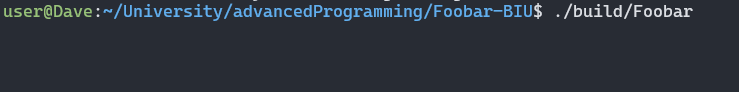

# Bloom Filter Overview

## Running the Bloom Filter Server
The bloom filter server is written in C++ and is built using CMake. This application is designed to run on Linux, so we will assume a Linux environment in this wiki page.

### Manually compiling and running
To locally compile and run the server, we will first have to setup the environment. Once we are in the root directory of the [Bloom Filter Repository](https://github.com/AsifMadar/Foobar-BIU), we will and run the following commands:
```bash
sudo apt-get update;
sudo apt-get install build-essential cmake libgtest-dev;
cmake -B build -S .
```

This will setup the environment. Now, we can compile the program using `cmake --build build`

Finally, we can run the server using `./build/Foobar`.

### Building and Running Using Docker
If you prefer, you can also build and run the program using docker. To do so, you first need to build the docker image using `docker build -t foobar-biu . -f DockerFile`. Afterwards, you can run the container using `docker run -p 5555:5555 -it foobar-biu`.

If you changed the port of the server (see below), replace `5555` in the last command with the new port.

### Changing the Port
By default, the bloom filter server runs on port `5555`. To change the port used by this server, modify the `SERVER_PORT` define in `src/main.cpp` and recompile the program or rebuild the docker image (depending on how you want to run the server).

## Accessing and Using the Bloom Filter Server
As mentioned above, the bloom filter server is hosted on port `5555` by default.

The bloom filter server is a TCP server, so we can communicate with it using TCP messaging. Here is a minimal Python script that you can use to play around with the bloom filter server. This script connects to the bloom filter server, and sends messages from the user (you) to the server, while printing the response, until the user issues a "quit" command:
```python
import socket
s = socket.socket(socket.AF_INET, socket.SOCK_STREAM)
dest_ip = '127.0.0.1'
dest_port = 5555
s.connect((dest_ip, dest_port))
msg = input('Message to send ("quit" to exit): ')
while not msg == 'quit':
	s.send(msg.encode())
	data = s.recv(4096)
	print('Server sent: ', data)
	msg = input('Message to send ("quit" to exit): ')
s.close()
```

When first running the server, no output is printed. This is normal; output will be printed once clients start connecting to the server.



Once a client has connected to the server, the client's details will be printed to the console.


At this point, the bloom filter hasn't been set up, so the server is expecting a valid bloom filter configuration line (e.g. `8 1 2` or `100 1`). Any input that is not a valid configuration line will trigger the following response from the server:


The first valid bloom filter configuration line will receive a response of `"OK"`. Once a valid bloom filter configuration line has been provided, the server will pass along any messages to the bloom filter.

* Messages adding a URL to the blacklist (e.g. `1 http://hi.com`) will receive a response of `"OK"` once the URL was added to the blacklist.
* Messages checking a URL (e.g. `2 http://hi.com`) will receive a response of `"true true"` if the provided URL has indeed been blacklisted, a response of `"true false"` if the URL hasn't been blacklisted but the bloom filter reported it as blacklisted (false positive), and a response of `"false"` if the URL hasn't been blacklisted and hasn't been detected by the bloom filter.
* Any message that is not a valid bloom filter command (e.g. `3 invalid`, or `8 1 2` after the bloom filter has been initialized) will receive a response of `"No valid input was provided"`.


And on the client side:


The server uses multithreading, assigning a new thread to each client. The server also utilizes a lock on the bloom filter, to avoid concurrent access to shared resources. This means that the server can handle multiple clients concurrently:


