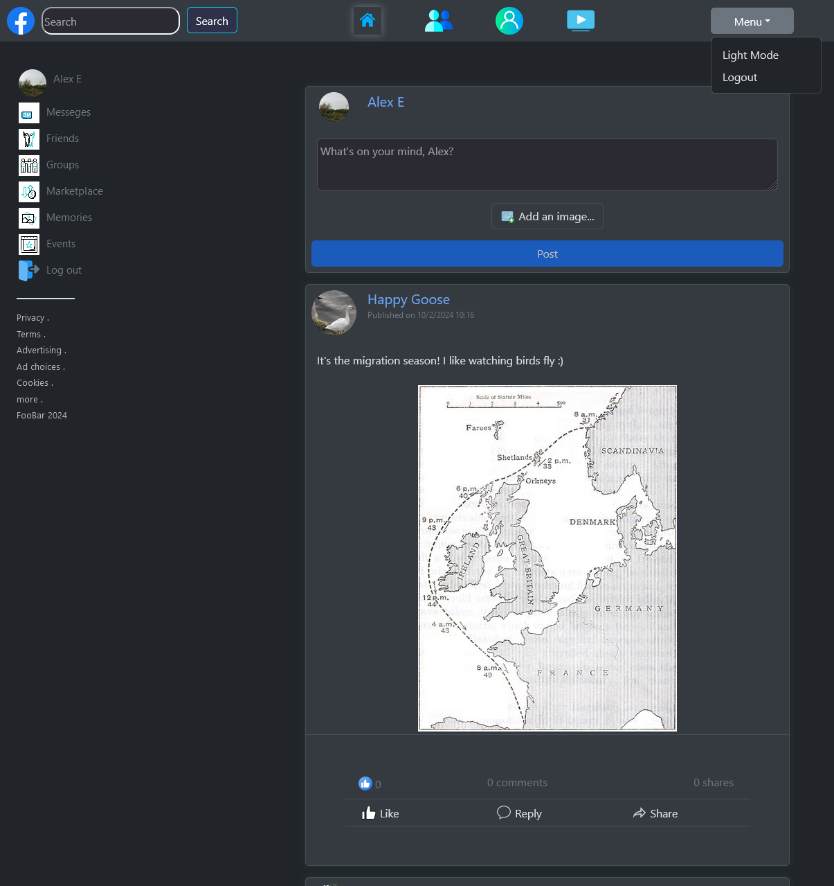
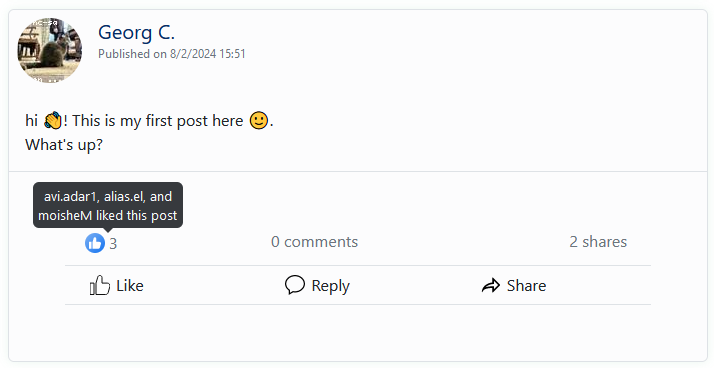
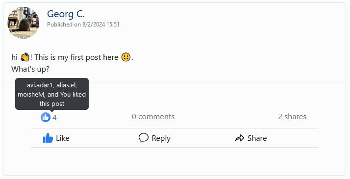
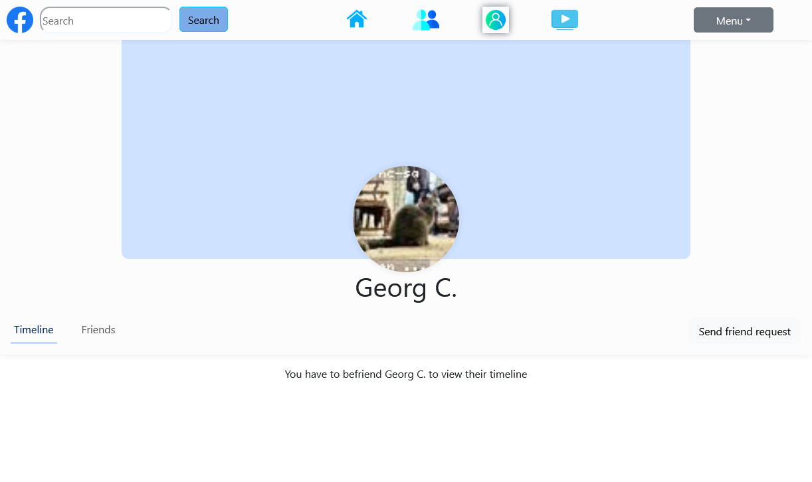

# Web Application Overview

## Running the Web Application
The web application is actually directly integrated into the backend server. So to run the web application, we simply follow the instructions for [running the backend server](./backend.md), then access the server's port from the browser. By default, the backend server is hosted on port 8080, which means to access the web application we will go to `localhost:8080`.

## Accessing and Using the Web Application

When first opening the app, we are greeted with the login screen.

The login screen consists of username and password fields, a login button and a "sign up page" button, which will take us to the sign up page.

Right now, we still don't have an account. If we try to login anyway with incorrect credentials, we will receive a message saying that the credentials are incorrect.

Going to the sign-up page, we can see 5 different input fields: A username field, password and password-validation fields, a profile picture field and a display name field. Next to each field, the requirements for that field are explicitly stated, to help onboarding the user, and avoiding the frustration of thinking of a great username only to find out that it is invalid.

Under the input fields, we can see a sign up button (more on it in a moment) and a "sign in page" button, which will take us to the sign in page.

In addition to the requirements for each field being explicitly stated, the user receives real-time feedback: If a value is valid, the field will become green and will be marked with a green check mark. If the value of the field is invalid, it will become red and will be marked with an exclamation mark, alongside a notice explaining the current value is invalid.

When trying to sign up with invalid details, the sign-up will be rejected and an error message will be displayed to the user.

If all the fields are filled correctly, the user can click "Sign Up", which will create the new account and will automatically login into the newly created account.

After signing up or logging in, the user is taken to their feed. The feed consists of the last 20 posts from friends of the current user (including the user himself), and the 5 last posts from other users, who are not friends with the current user.

The top and side navigate bars contain multiple features, with some redundancy to ensure a seamless and intuitive user experience.

Number 1 is the link to the profile page of the current user, which we will explore in depth later. Number 2 is the link to the friend requests list, which will also be explored soon. Number 3 is the logout button, which can be found in the top menu and also directly on the left sidebar. Number 4 allows toggling dark theme on and off, and number 5 is the link to the feed, which is currently active.

This is how the feed is displayed when dark theme is enabled. All screens in the application adapt to dark theme, to ensure a seamless integration for dark theme lovers:

The top part of the feed is the post creation box, which is used to create and publish new posts. In this screenshot, we can see the user entered some text in the text box for the new post. The "Post" button, which was disabled while the text box was empty, is now enabled.

The "Add an image..." button can be used to add an image to the post. After adding an image to the post, a preview is displayed and the image can be deleted from the post by clicking the "X" button on the corner of the image.

When clicking "Post", the new post is published to the server, and the feed is updated.

However, if the user tries to post a malicious link that has been blacklisted by the administrator, such as in this case:

... then the post is *not* published, and the user is notified of the reason.

When hovering over a post created by the current user, two buttons appear: "Delete", which will permanently delete the post, and "edit", which will enter editing mode for the post.

When in editing mode for the post, the user can freely edit the post's text and add or remove images from the post. When done, clicking "Post" will update the post. Again, trying to insert a blacklisted link to the edited post will be caught by the server, and the above message will be displayed.

Now, let's take a closer look at other users' posts. In this screenshot, we can see what a post looks like:

We are going to explain the different post features one by one. At this point, you might wonder why the "comments" and "reply" components are not highlighted. This is because while this application already has built-in support for comments, the backend server currently doesn't. However it should be very simple to enable comments in the application once the backend adds support for that.

Number 1 is the post count. Here you can see the number of users who liked this post. If you hover over the number, you can see who liked the post.

 

Number 2 is the shares count. Here you can see the number of users who shared this post. If you hover over the number, you can see who shared the post.

 

Number 3 is the like button. By clicking this button you will like the post, will will add you to the list of users who liked this post. The like button for posts liked by the current users is colored blue.

 

Number 4 is the share button. By clicking it, the share menu will open. The share menu opens in a modal, floating above the rest of the page. As you can see here, we currently don't have many options for sharing posts, but this could be easily expanded in the future.

Number 5 is the profile of the user who posted this post. Clicking on it will take us to the profile page of that user. Speaking of which, we should probably take a look at how profile pages look on this platform. So let's click on the profile of Georg C.!

 

We can see here several features. At the top we still have our trusty top bar, which can be used to navigate the app, toggling dark theme on/off and logging out. At the middle of the page, we can see the picture and display name of the user, and right under it we have 3 buttons.

Number 1 is the timeline button. Clicking it will enter the timeline, where we can see the posts that Georg has posted (this is also enabled by default when you enter a profile). Unfortunately, we cannot see these posts since we are not friends yet. Number 2 is the friends button. Clicking it will enter the friends list for Georg. Number 3 is the button for sending a friend request to Georg.

 

After clicking the "Send friend request" button, the button is disabled and its text is changed to "Sent!".

 

In the friends list, we can see who is already a friend of Georg. In this case, Georg has 3 friends.

 

Okay. Let's go to our friend requests page to see if we received any friend requests in the meantime. We do that by pressing the friends requests button at the top of the page.

As you can see, when you look at your own profile you also get access to the friends requests list, so clicking the friends requests button at the top is not the only option to get here.

Hey, look! johnny sent us a friend request. We can reject the request, which will make it go away, but let's be nice. We will accept the request by clicking the green "Accept" button. This will make the request disappear, and johnny wil become our friend.

Let's go to our friends list.

Hey, guess who is there? It's our friend Johnny of course. If we ever change our mind, we can dismantle the friendship by clicking the red "Remove" button next to his name. But right now we don't want to do that.

Oh, we were so excited about our new friend, that we almost forgot about the "Edit Profile" button on the right. If we click it, we can see that we get the option to change our display name or profile picture, or even completely delete the account. Let's not do that though.

Let's go back to the feed.

Oh, look! Our friend Johnny has posted a new post. Let's give it a like and go to Johnny's profile.

Since we are friend with Johnny, we can now see their posts on their profile. Of course, we can like and share their posts from here just like we can do in the main feed.

If we take a look in Johnny's friends list, we can see ourselves there. Nice!

For completeness sake, this is what Johnny's profile look like in dark mode:

Finnally, if we click the logout bottun at the top menu, we will be logged out of the application, just as expected.

That's all there is to know about the web application!
